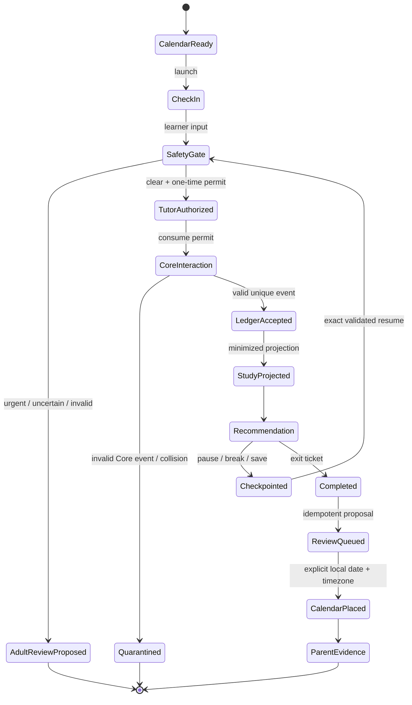

# Unified state diagram

Academic processing cannot bypass the safety gate, permit, Core validation, or accepted-event ledger. A proposed adult-review or outbox item is never represented as delivered.
