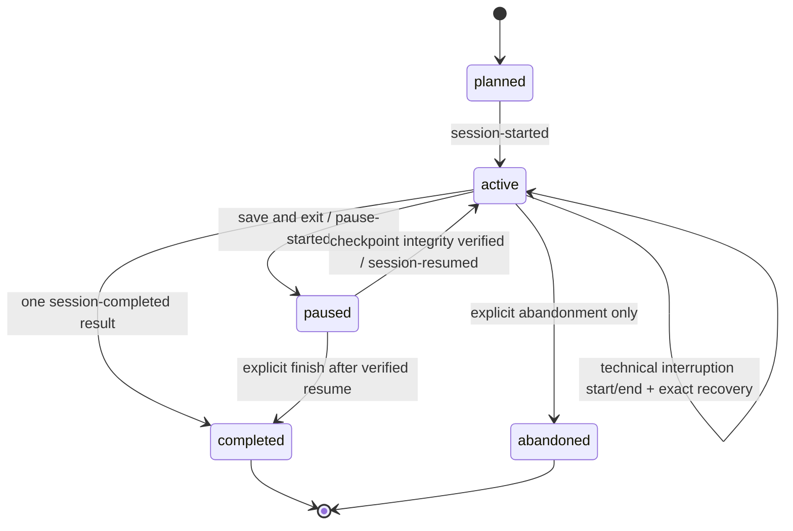
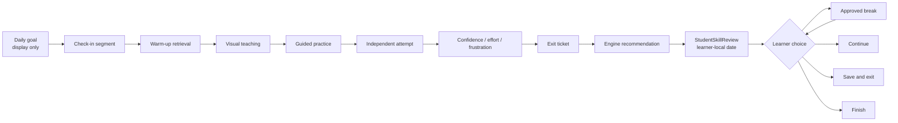

# Canonical student runtime state diagram

The canonical `StudySession.status` is authoritative. React screen names,
timer presentation, form drafts, and Session 3 component state are projections.

Approved breaks and recoverable technical interruptions are event-backed
substates while canonical status remains `active`. The implementation records a
technical recovery as an atomic start/end/resume sequence, so no unverifiable
intermediate snapshot is persisted.

## Learning flow

Only the seven planned canonical segments—check-in plus six learning
segments—emit `segment-completed`. The daily goal, engine calculation, review
record, break, and final choice do not inflate progress.

## Transition invariants

1. The completed segment must equal the active canonical segment.
2. Completed segment IDs must remain in plan order and unique.
3. Breaks carry an `InterruptionId`, save an exact `ResumePoint`, pause active
   time, and cannot produce failure or completion evidence.
4. Technical interruptions have distinct events and counts.
5. A paused or break checkpoint retains session, lesson, segment, canonical
   task identity, ordered completed segments, safe instructional cursor,
   per-segment active time, paused time, break time, protected draft reference,
   draft revision, last accepted event ID/version, opaque Tutor recovery
   reference, technical-interruption state, validated IANA time zone, and an
   integrity digest.
6. Terminal completion partitions planned segments and emits one result.
7. The same command ID/content is a no-op; the same ID with changed content is
   an idempotency conflict.
8. Unsupported versions, stale revisions, and forged histories cannot
   transition the machine.
9. Cross-session checkpoints are rejected, and the last accepted event binding
   prevents duplicate replay after recovery.

The checkpoint never stores raw answers or learner responses, transcripts,
names, emails, diagnosis language, credentials, or adult-private notes.
