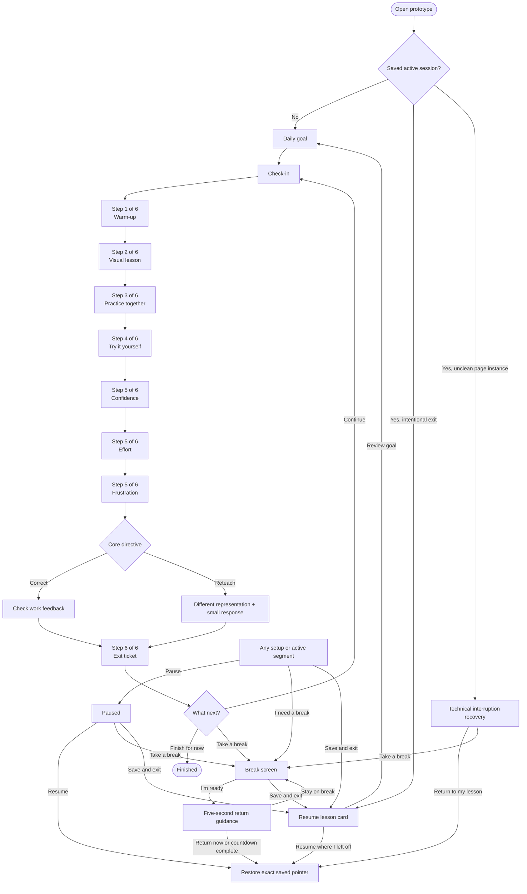
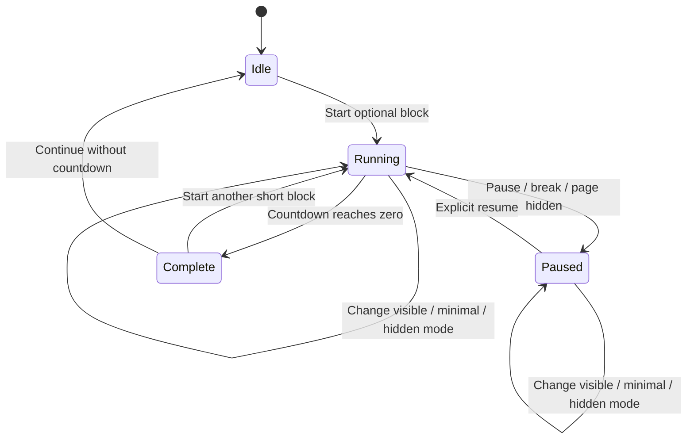

# Student Study Session UX Specification

Status: implementation-ready prototype specification  
Audience: Student UX, accessibility, Jarvis interaction, and UI test owners  
Scope: grades 4–6 local browser prototype only

## 1. Experience intent

The study session should feel bounded, calm, and recoverable. The learner sees one meaningful task at a time, always knows where they are in the learning sequence, and can ask for help, pause, take a break, or leave without losing work.

The required learner flow is:

> Daily goal → Check-in → Warm-up retrieval → Short visual lesson → Guided practice → Independent attempt → Confidence and effort check → Exit ticket → Break, continue, or finish

The interface must not equate time spent with learning progress. The primary progress display represents completed learning segments. The optional timer is a separate pacing aid and never advances, grades, or submits work.

### Product rules

1. Show only one instructional prompt and one response task at a time.
2. Keep the visual teaching board separate from the Jarvis core.
3. Preserve agency: help, another explanation, a break, and save-and-exit remain available throughout active work.
4. Treat confidence, effort, frustration, timer behavior, and break use as learner reports or pacing signals, not as proof of mastery.
5. Do not use urgency, shame, streak loss, red countdown states, entertainment rewards, or language about being “behind.”
6. Never require audio, motion, or a visible timer to complete a lesson.
7. Save before every navigation or completion transition.
8. A refresh or reopened browser returns to the exact segment, item, response draft, and paused/running state.
9. The UI must not derive a `correct` or `reteach` directive. It renders the directive supplied by the authoritative tutor core.

## 2. Existing patterns to reuse

The current Manuel Academy tutor components are useful as interaction references. They should be adapted into the standalone study prototype without importing adult-facing state or production services.

| Existing component | Reuse | Required adjustment |
| --- | --- | --- |
| `src/components/tutor/PushToTalkMic.tsx` | Explicit press-and-hold recording; Space/Enter keyboard behavior; speech becomes a draft for review rather than auto-submitting | The existing component disappears when speech recognition is unavailable. The study UI must instead keep a visible “Answer aloud” affordance with an adjacent explanation and typing fallback. Also handle pointer cancellation and always provide a separate stop control while listening. |
| `src/components/tutor/TutorChat.tsx` | Task-scoped support, text transcript, typing path, captions/text paired with optional speech, and scripted offline degradation | Replace open-ended chat with the approved learner actions. Remove answer-leaking risk and family-role-specific copy. The study session must remain usable without a key or network. |
| `src/components/assistant/AssistantOrb.tsx` | Proposed actions require learner confirmation; spoken replies also appear as text; transcript history persists; microphone transcript is reviewable | Rebuild the visual as the approved dark circular Jarvis core with layered orange rings. Do not reuse the blue emoji treatment, high-school context, usage meter, or network dependency. |
| Study-engine orchestrator types | Phase names, event order, pacing dispositions, opaque session reference, and authoritative `coreDirective` | Keep UI-only pause and in-segment break overlays orthogonal to the engine phase. Do not change engine types from the UI package. |

The standalone prototype may reuse the interaction contracts without directly depending on the application components.

## 3. Session shell and information hierarchy

### Desktop shell

The session shell has five stable regions:

1. **Utility header**
   - “Manuel Academy Study”
   - Today’s goal, compact after setup
   - Pause / Resume
   - Save and exit
   - Timer mode control
2. **Learning progress**
   - Current text: “Step 2 of 6”
   - Six segment labels with completed/current/remaining states
   - No percentage based on time
3. **Visual teaching board**
   - Current instruction, visual representation, prompt, and active response
   - Semantic text equivalent for every visual
4. **Jarvis companion**
   - Circular core, current caption, transcript toggle, audio state
   - Visually separate from the teaching board
5. **Learner action area**
   - Primary task action
   - Persistent “I need a break”
   - “I need something” opens the full support menu

At desktop widths, the teaching board occupies roughly two-thirds of the main area and Jarvis occupies one-third. They are separate cards with separate headings and landmarks. Jarvis must never obscure the prompt or become the only place instructional text appears.

### One-task-at-a-time presentation

- One heading names the current task.
- One prompt and one response control are active.
- Future questions and future lesson text are not rendered below the fold.
- Confidence, effort, and frustration are three sequential substeps within “Check your work,” not three simultaneous forms.
- A support choice may temporarily replace the task with one alternate explanation or example. “Back to my task” restores the exact draft.
- A modal or sheet makes the background inert and returns focus to its invoking control when dismissed.
- Stable shell controls do not count as additional tasks, but secondary controls are visually quiet.
- “Previous” may reopen a completed segment for review. Reviewing does not remove completion or emit another completion event.
- The learner cannot skip forward into an incomplete segment. Break and save-and-exit are always allowed.

## 4. Learning progress model

Daily goal and check-in are setup screens. They are required but are outside the six learning-segment denominator. Once check-in is complete, the session uses this exact primary progress model:

```text
✓ Warm-up
● Visual lesson
○ Practice together
○ Try it yourself
○ Check your work
○ Finish
```

The screen-reader equivalent is:

> Learning progress. Step 2 of 6. Warm-up, completed. Visual lesson, current. Practice together, not started. Try it yourself, not started. Check your work, not started. Finish, not started.

| Step | Segment ID | Learner-facing label | Completion rule |
| --- | --- | --- | --- |
| 1 | `warmup` | Warm-up | The learner submits the retrieval response and sees its brief follow-up. |
| 2 | `visual-lesson` | Visual lesson | The learner views the short explanation and completes its active notice/predict response. |
| 3 | `guided-practice` | Practice together | The learner contributes at least one step and confirms the worked result. Jarvis may scaffold but must not complete it without a learner contribution. |
| 4 | `independent-attempt` | Try it yourself | The learner submits an answer or explanation without the guided answer being filled in. Support actions remain available. |
| 5 | `check-work` | Check your work | Confidence, effort, and frustration are each recorded, followed by any core-directed correction or reteaching. |
| 6 | `finish` | Finish | The exit-ticket response is preserved and the learner reaches the break / continue / finish choice. |

Segment completion is never triggered by the timer, audio playback ending, merely opening a screen, or navigating back over completed work.

### Phase adapter mapping

| Learner experience | Orchestrator phase | Event after the UI completion rule |
| --- | --- | --- |
| Daily goal + check-in | `check_in` | `check_in_completed` |
| Warm-up | `retrieve_prior_knowledge` | `prior_retrieval_completed` |
| Visual lesson | `teach_visually` | `visual_teaching_completed` |
| Practice together | `guided_practice` | `guided_practice_completed` |
| Try it yourself | `independent_attempt` | `independent_attempt_completed` |
| Confidence / effort / frustration | `confidence_check` | `confidence_check_completed`, with `coreDirective` supplied by the core |
| Feedback or alternate teaching | `correct_or_reteach` | `core_instruction_completed` |
| Exit ticket follow-up | `schedule_future_review` | `review_scheduled`, with date supplied outside the UI |
| Break / continue / finish choice | `break_continue_or_finish` | `pacing_disposition_recorded` |
| Between-cycle break | `on_break` | `break_resume_confirmed` |

Effort and frustration do not currently have fields in the provisional orchestrator event. Store them in the local prototype state and expose them through a UI adapter payload; do not overload confidence or infer an engine directive.

An in-segment learner-requested break is a local UI pacing state. It pauses instructional time and preserves the engine phase and exact UI pointer. It does not falsely complete the phase. A break chosen at the end-of-cycle disposition may use the orchestrator’s `on_break` state.

## 5. Canonical learner flow

### 5.1 Daily goal

Show one short, observable goal and the subject/session label.

Example:

> Today’s goal  
> Compare two fractions using a visual model and explain how you know.

Actions:

- “Start check-in” — primary
- “Resume saved lesson” — only when a saved session exists
- Timer setting: Visible countdown / Minimal / Hidden
- Access settings: Audio on/off, captions on, minimal animation, text size

The goal remains available in compact form throughout the session. Changing access or timer settings never resets work.

### 5.2 Check-in

Ask one neutral question at a time:

1. “How ready do you feel to start?” — “Ready,” “Not sure yet,” “I need a gentler start”
2. “Would you like Jarvis to speak, or use text only?” — “Speak and show captions,” “Text only”
3. If the visible countdown was selected: “Keep the countdown visible?” — “Visible,” “Minimal,” “Hidden”

The response adjusts presentation only. It does not lower expectations, assign a diagnosis, or skip required instruction. “I need a gentler start” leads to a shorter first prompt and an immediate reminder that break/help controls are available.

### 5.3 Warm-up retrieval — Step 1 of 6

- One prior-knowledge item
- No long instruction before the response
- “Check my response” is protected against rapid double activation
- A brief, specific follow-up appears before “Continue”
- The draft saves as the learner types or selects

### 5.4 Short visual lesson — Step 2 of 6

- One concept and one visual relationship
- Target length: 60–120 seconds of reading/listening, not enforced by the timer
- Visual board has a text equivalent
- Jarvis may narrate the same content; captions remain visible
- End with one active notice/predict response such as “Which bar is longer?” or “Which detail is the clue?”

### 5.5 Guided practice — Step 3 of 6

- Jarvis frames a bounded problem and asks the learner for the next step
- “Let’s do one together” is naturally selected here but remains learner-initiated elsewhere
- Each Jarvis hint pauses for a learner response
- The learner contributes before the worked result is revealed
- A break may occur after any substep; return restores the same substep and draft

### 5.6 Independent attempt — Step 4 of 6

- One new item at the same target skill
- The answer field starts empty
- Help actions provide scaffolds or a parallel example, not the final answer to the active item
- “Continue independently” dismisses Jarvis help and returns focus to the active response
- “Let me answer aloud” fills an editable draft; the learner must confirm submission

### 5.7 Confidence, effort, and frustration — Step 5 of 6

Show these as three short screens:

1. **Confidence:** “How sure do you feel about your approach?” — 1 “Not sure yet” through 4 “Very sure”
2. **Effort:** “How much effort did this take today?” — 1 “A little” through 4 “A lot”
3. **Frustration:** “How frustrating did this feel?” — 1 “Not frustrating” through 4 “Very frustrating”

Every value is valid. Do not show happy/sad faces that imply a preferred answer. Do not translate the values into mastery labels in the student UI.

If frustration is high, immediately offer:

- “Take a break”
- “Show me another way”
- “Keep going with my answer”

Then render the core-supplied correction or reteach experience. When the core directive is `reteach`, the learner sees a new representation and one small response before continuing. The UI must not choose that directive from confidence, effort, frustration, correctness, timer use, or break count.

### 5.8 Exit ticket — Step 6 of 6

Show one concise transfer item. Preserve the response before any feedback or navigation. After submission, show a neutral session recap:

- Six-segment progress
- One statement about what was practiced
- “Your response is saved”

Then present three equal, clearly labeled choices:

- “Take a break”
- “Continue with another learning block”
- “Finish for now”

“Finish for now” is not visually framed as the lesser choice. “Continue” starts a new cycle with its own six-segment progress while preserving the completed cycle in history. A break returns to this exact choice unless the adapter has intentionally begun a new engine cycle.

## 6. Required learner actions

The persistent button “I need something” opens a labelled sheet. “I need a break” also remains a direct one-tap action outside the sheet.

| Exact action label | Required behavior |
| --- | --- |
| I need help | Ask one clarifying choice: “The directions,” “The first step,” or “My answer.” Then show one bounded hint. |
| Show me another way | Replace the current explanation with a different representation, preserving the same learning goal and active draft. |
| Talk me through it | Narrate and caption one step at a time. Stop after each step for learner confirmation or response. |
| Let’s do one together | Open a parallel guided example. Do not fill the independent item’s answer. Return to the original item afterward. |
| Give me a different example | Change the surface context while keeping the skill and approximate difficulty. |
| This is too easy | Acknowledge the report and offer “Try a challenge example” or “Continue.” Do not infer mastery from the report alone. |
| This is too hard | Acknowledge the report and offer a smaller step, another representation, or a break. Do not use remedial labels. |
| I need a break | Save the exact return pointer, pause instructional time, and open the break screen immediately. |
| Read this to me | Read only the current prompt/instruction, show synchronized captions, and provide “Stop reading.” If audio is unavailable, keep the text visible and explain the fallback. |
| Let me answer aloud | Start explicit push-to-talk. Put recognized text into an editable response draft; never auto-submit. |
| Continue independently | Stop current Jarvis speech, close the support sheet/alternate example, and focus the active response control without completing it. |

Action availability must not depend on answer correctness. Each action is keyboard reachable, has a minimum 44 by 44 CSS-pixel target, and remains meaningful in text-only mode.

## 7. Jarvis interaction and visual teaching board

### Visual teaching board

The board is the authoritative visible learning surface:

- Heading names the current concept or task
- Diagram, passage, model, or worked step
- Plain-text equivalent adjacent to or immediately following the visual
- Current prompt
- Active response

For a fraction bar, the text equivalent might be: “The first bar has 6 of 8 equal parts shaded. The second has 5 of 8 shaded.” For reading highlights, the equivalent names the highlighted sentence and its role as a clue.

### Jarvis core

The approved visual is a dark futuristic circular core with:

- A dark central disk
- Two or more layered rings
- Orange primary energy ring
- Low-intensity continuous rotation while motion is allowed
- A brighter pulse only while Jarvis is speaking
- A clear text state: “Ready,” “Listening,” “Thinking,” “Speaking,” “Text only,” or “Audio unavailable”

The rings are decorative and `aria-hidden`. A concise accessible name describes state, for example, “Jarvis, speaking.” State must never be conveyed by color or motion alone.

Jarvis never becomes a free-roaming entertainment surface. It responds within the current lesson task, does not include external links, and does not gate progress behind audio.

### Captions and transcript

- Current Jarvis speech appears as a caption whenever audio plays.
- Captions remain available in text-only mode as the primary message.
- Captions do not disappear before the learner moves on.
- “Open transcript” reveals an ordered, scrollable history with speaker labels “Jarvis” and “You.”
- Opening the transcript does not pause or reset the task.
- New transcript content is announced politely only after a learner action; timer ticks are never added.
- Transcript content persists across refresh and save-and-exit in local mock storage.

### Audio unavailable and no-audio behavior

If speech synthesis or speech recognition is unavailable:

- Render the complete instruction and caption.
- Show “Audio isn’t available on this device. You can keep going with text.”
- “Read this to me” remains visible but disabled with that explanation associated through `aria-describedby`.
- “Let me answer aloud” offers “Type my answer instead” and focuses the text field.
- Never show a fake listening state.
- Never treat missing audio as a technical session interruption.

No-audio mode stops active speech immediately, persists the preference, and leaves captions/transcript enabled.

## 8. Timer, pause, and resume

### Timer modes

The learner may change modes at any time:

| Mode | Visible UI | Screen-reader behavior |
| --- | --- | --- |
| Visible countdown | A small `mm:ss` value inside a minimal circular timer; no red urgency state | Announce when started, paused, resumed, and completed. Do not announce every tick. |
| Minimal progress indicator | A small non-numeric circular progress mark and “Work block running” | Do not expose a changing numeric value unless requested. |
| Hidden | No circle and no remaining-time value; show a quiet “Timer hidden” option in settings | Do not expose hidden remaining time through unsolicited announcements. |

The timer mode persists across refresh. Selecting Hidden must fully honor the choice. Timer state is visually and semantically separate from six-step learning progress.

### Timer behavior

- Countdown is optional and off by default unless a saved preference selects it.
- Reaching zero does not auto-submit, mark a segment complete, move focus, play an alarm, or turn the interface red.
- At zero, show once: “This work block is complete. Choose what helps next.” Actions: “Continue without a countdown,” “Start another short block,” and “Take a break.”
- Paused, break, save-and-exit, and return-countdown time does not reduce instructional time.
- Background-tab time does not silently consume the countdown. On visibility return, ask whether to resume if the session was automatically paused.

### Pause / Resume

“Pause” writes the current draft and exact focus pointer, stops Jarvis speech, pauses the optional timer, and shows:

> Paused  
> Your place and your work are saved.

Actions:

- “Resume”
- “Take a break”
- “Save and exit”

“Resume” restores the exact screen, substep, response draft, timer mode, and focus target. It does not replay speech automatically.

## 9. Break experience

### Entry

On “I need a break”:

1. Disable the invoking button against double activation.
2. Save the response draft, engine phase, segment, item/substep, scroll position when useful, focus target, timer state, and a stable break ID.
3. Pause instructional time and stop Jarvis speech.
4. Open the break screen.

Do not show a break count, penalty, missed-time indicator, or permission challenge.

### Break screen

Heading:

> Take the break you need

Support text:

> Your work and your place are saved. Choose a quiet reset, or just take a moment.

Safe configurable examples:

- Get water
- Walk briefly
- Stretch
- Look away from the screen
- Quiet breathing
- Parent-configured movement

These are plain buttons or informational cards, never external links. The screen contains no games, videos, web links, streaks, or unrelated entertainment.

Selecting an activity does not start a requirement to prove completion. A parent-configured movement label must be plain text and cannot inject markup or navigation.

### Return guidance and countdown

The break screen always shows where the learner will return:

> When you’re ready, you’ll return to Step 3 of 6, Practice together, on the same question.

Actions:

- “I’m ready to return”
- “Stay on break”
- “Save and exit”

“I’m ready to return” opens a gentle five-second return screen:

> Returning to your lesson in 5  
> Your next step is still waiting.

Actions:

- “Return now”
- “Stay on break”

The return countdown is not instructional time, has no alarm, and can be bypassed. In minimal-animation mode the numeral changes without scale, pulse, spin, or sweep animation. Screen readers announce the initial guidance and “Ready to return” at completion, not every numeral.

Return restores the exact segment, item/substep, draft, and timer mode. The optional instructional countdown remains paused until the learner explicitly chooses “Resume timer” or “Resume lesson,” depending on the implementation.

Repeated breaks follow the same flow without changed tone or reduced access.

## 10. Local persistence and recovery prototype

Use local mock storage only. Do not add authentication, identity, network storage, Supabase, or databases.

### Minimum persisted state

```ts
interface LocalStudySession {
  schemaVersion: "study-ux-prototype.v1";
  sessionRef: string;
  lessonId: "math-fractions" | "reading-inference";
  subject: "math" | "reading";
  goal: string;
  cycleNumber: number;
  orchestratorPhase: string;
  segmentId: string;
  segmentIndex: number;
  itemId: string;
  substepId?: string;
  screen:
    | "goal"
    | "check-in"
    | "task"
    | "paused"
    | "break"
    | "return-countdown"
    | "exit-choice"
    | "finished";
  drafts: Record<string, string>;
  responses: Record<string, unknown>;
  checks: {
    confidence?: number;
    effort?: number;
    frustration?: number;
  };
  timer: {
    mode: "visible" | "minimal" | "hidden";
    status: "idle" | "running" | "paused" | "complete";
    blockSeconds: number;
    remainingSeconds: number;
    lastTickAt?: string;
  };
  breakState?: {
    breakId: string;
    activity?: string;
    startedAt: string;
    returnPointer: string;
  };
  completedSegmentIds: string[];
  emittedEventIds: string[];
  transcript: Array<{ id: string; speaker: "jarvis" | "learner"; text: string }>;
  preferences: {
    audio: "on" | "off";
    captions: boolean;
    minimalAnimation: boolean;
    textScale: number;
  };
  interruption: {
    cleanExit: boolean;
    pageInstanceId: string;
    lastHeartbeatAt: string;
    recordedInterruptionIds: string[];
  };
  updatedAt: string;
}
```

The concrete implementation may refine the shape, but it must preserve every behavior represented above.

### Save timing

- Save response drafts on every meaningful change, with no more than a short 250 ms debounce.
- Save synchronously before segment navigation, pause, break, timer mode changes, transcript changes, and save-and-exit.
- Use stable content IDs; never rely only on an array index.
- Show “Saved on this device” as a quiet status, not a blocking toast.

### Duplicate completion prevention

Use a stable event key such as:

```text
completion:{sessionRef}:{cycleNumber}:{orchestratorPhase}
```

On completion:

1. Ignore additional activation while the transition is in progress.
2. If the key already exists in `emittedEventIds`, do not emit again.
3. Persist the response and event key before changing the visible pointer.
4. Advance the local pointer.
5. On reload, reconcile the pointer from the event ledger if a crash happened between steps 3 and 4.

Rapid Enter, a double click, a refresh during feedback, browser history navigation, or rehydrating React in development must not create duplicate completion events.

### Refresh and technical interruption recovery

Keep a local page-instance ID, clean-exit flag, and heartbeat:

- Starting or resuming active work marks the page instance as active/unclean.
- Explicit pause, break, save-and-exit, and finish persist their reason and stable pointer.
- A later load that finds active work without an intentional exit reason treats it as a technical interruption candidate.
- Record that candidate once with a stable interruption ID, separate from learner breaks and session completions.
- A stale heartbeat covers abrupt browser or tab closure when `beforeunload` does not run.
- Rehydration itself must not create another interruption record.

Recovery copy:

> Your work is safe  
> The page was interrupted, so we brought you back to Step 4 of 6, Try it yourself. Your answer is still here.

Actions:

- “Return to my lesson” — primary
- “Take a break”
- “Save and exit”

Focus moves to the recovery heading, then “Return to my lesson.” Returning restores the exact draft and does not auto-replay audio.

### Resume lesson card

After intentional save-and-exit or closing/reopening:

> Resume your lesson  
> Math · Compare fractions  
> Step 4 of 6: Try it yourself  
> Your answer and settings are saved on this device.

Actions:

- “Resume where I left off” — primary
- “Review today’s goal”

Do not display time remaining on the card when timer mode is Hidden. Do not mark an intentional save-and-exit as a technical interruption.

## 11. Sample grades 4–6 sessions

### Mathematics session: Grade 5 fraction comparison

**Goal:** Compare two fractions using equivalent fractions and a visual model, then explain the comparison.

| Flow point | Prototype content and interaction |
| --- | --- |
| Daily goal | “Compare two fractions using a visual model and explain how you know.” |
| Check-in | Readiness, audio/text, and timer-visibility choices. |
| Warm-up | “Complete the equivalent fraction: 1/2 = ?/8.” Learner types `4`. Follow-up connects equal-size pieces. |
| Visual lesson | Separate board shows `3/4` as `6/8` above `5/8`, using two equal-length fraction bars. Text equivalent names shaded parts. Active response: “Which bar has more shaded eighths?” |
| Guided practice | Compare `2/3` and `3/5`. Jarvis asks first, “What common denominator could we use?” Learner contributes `15`; the board then builds `10/15` and `9/15` one step at a time. |
| Independent attempt | Compare `5/6` and `7/9`, choose `<`, `=`, or `>`, and add one sentence explaining the model or equivalent fractions used. Help uses a parallel example, not this answer. |
| Break demonstration | Request a break after entering the common denominator in guided practice. Resume at that substep with `15` still present and the instructional timer paused. |
| Confidence / effort / frustration | Three sequential four-point checks. Core-directed feedback follows. |
| Exit ticket | Compare `4/6` and `5/9`; select the relation and explain one piece of evidence. |
| End choice | Take a break / Continue with another learning block / Finish for now. |

Visual accessibility: every fraction bar has a visible numeric label and a sentence equivalent. Color is not the only differentiator; shaded parts also use a pattern or border.

### Reading session: Grade 5 inference and evidence

**Goal:** Make an inference about a character and support it with a detail from the passage.

Short original passage for the prototype:

> Mina carried three seedling trays toward the porch as the first drops tapped the path. She moved the smallest plants under the roof, then ran back for the last tray. When rain began drumming on the steps, she counted every pot before she smiled.

| Flow point | Prototype content and interaction |
| --- | --- |
| Daily goal | “Make an inference and point to the detail that supports it.” |
| Check-in | Readiness, audio/text, and timer-visibility choices. |
| Warm-up | Sort one statement as “detail from the text” or “idea I infer.” |
| Visual lesson | Board shows a three-part chain: **Clue** (“counted every pot”) → **What I know** (people count when they want to make sure none are missing) → **Inference** (Mina is careful about the plants). Active response asks which sentence is the strongest clue. |
| Guided practice | Jarvis and learner build an inference about why Mina ran back. Learner selects the clue before Jarvis reveals the reasoning bridge. |
| Independent attempt | “What can you infer about how Mina feels responsible for the plants? Choose one detail and explain.” Response is a short textarea or reviewed voice draft. |
| Break demonstration | Request a break after highlighting a detail but before writing the explanation. Resume with the highlight and draft intact. |
| Confidence / effort / frustration | Three sequential four-point checks. A high-frustration response offers break, another way, or continuing. |
| Exit ticket | A new two-sentence micro-passage asks for one inference and one supporting phrase. |
| End choice | Take a break / Continue with another learning block / Finish for now. |

Reading support may read the passage aloud and visually track the current sentence, but it must not force audio or motion. The transcript and passage remain selectable and scalable text.

## 12. Mobile and text-scaling decisions

At widths below 768 CSS pixels:

- Use one column with this order: utility header, current progress, teaching board and response, Jarvis caption/core, learner actions.
- Keep the teaching task above the Jarvis decoration.
- Reduce the Jarvis core’s diameter, not the response controls or body text.
- Make “Pause,” “Save and exit,” and timer mode available from a labelled utility menu; keep “I need a break” directly visible.
- Present “Step X of 6” plus the current segment label. “View all steps” expands the complete six-item list so progress meaning is not lost.
- Use full-width primary actions and at least 44-pixel targets with 8-pixel separation.
- Do not use horizontal page scrolling at 320 CSS pixels.
- Ensure fixed actions account for safe-area insets and never cover the focused input or browser keyboard.
- Inputs use at least 16-pixel font size to avoid mobile browser zoom surprises.
- Transcript and learner-action sheets fit within the viewport, scroll internally, and keep a visible close button.

At 200% text scaling:

- Content reflows without clipping or overlapping rings.
- The goal, “Step X of 6,” prompt, response, and primary action remain in logical order.
- Timer circles may grow or move to their own row.
- Truncation is prohibited for instructional text, captions, progress labels, and saved-location text.

## 13. Keyboard, screen reader, motion, and contrast behavior

### Keyboard

- Provide a “Skip to current task” link.
- Use native buttons, links only for navigation, labelled textareas, and native radio groups where practical.
- Tab order follows the visual order and excludes hidden sheets/dialogs.
- Arrow keys move within radio groups; Space selects; Enter activates the primary button only when focus is on it.
- Escape closes transcript, timer settings, or learner-action sheets. It never discards work or exits the session.
- Opening a dialog moves focus to its heading or first meaningful control; closing restores focus.
- Push-to-talk supports Space/Enter press-and-hold, pointer press-and-hold, explicit stop, and cancellation without auto-submit.
- There are no single-key shortcuts that trigger while typing.

### Screen readers

- Use `header`, `nav` with “Learning progress,” `main`, named board and Jarvis regions, and `footer`/action region.
- Move programmatic focus to the new task heading after a learner-initiated segment transition.
- Use a polite live region for saved status, Jarvis replies, timer completion, and return readiness.
- Use an assertive alert only when an action cannot continue and immediate attention is needed.
- Do not announce every timer tick, ring rotation, caption animation frame, or autosave.
- Mark completed/current/remaining progress in text, not only icons.

### Reduced and minimal motion

Honor both `prefers-reduced-motion: reduce` and the in-product “Minimal animation” setting.

In either reduced mode:

- Stop ring rotation and speaking pulse animation.
- Represent speaking with a static brighter orange outline plus “Speaking.”
- Remove smooth scrolling, scale/zoom entrances, shimmer, and timer sweep animation.
- Change return-countdown numerals without animated transitions.
- Preserve every state and action; motion is never instructional evidence.

### Contrast and touch

- Body text and controls meet WCAG AA contrast in all states.
- Orange energy effects are decorative; critical orange text must still meet contrast.
- Focus indicators are at least 2 CSS pixels, high contrast, and not hidden by glow.
- Disabled audio controls include text explaining why; reduced opacity is not the only signal.
- All touch targets are at least 44 by 44 CSS pixels.

## 14. Non-shaming and recovery copy

| Situation | Approved learner-facing copy |
| --- | --- |
| Response needs another look | “This gives us something useful to check. Let’s look at one step.” |
| Alternate teaching | “We can show the same idea in a different way.” |
| Learner says it is too hard | “Thanks for telling me. We can make the next step smaller, try another example, or take a break.” |
| Learner says it is too easy | “Thanks for telling me. You can try a challenge example or continue.” |
| Timer reaches zero | “This work block is complete. Choose what helps next.” |
| Timer hidden | “Timer hidden. Your learning steps are still shown.” |
| First or repeated break | “Your place is saved. Take the break you need.” |
| Return from break | “Welcome back. Your next step is ready when you are.” |
| Pause | “Paused. Your place and your work are saved.” |
| Accidental refresh/interruption | “Your work is safe. The page was interrupted, so we brought you back to the same step.” |
| Voice recognition misses speech | “I didn’t catch that. You can try speaking again or type your answer.” |
| Audio unavailable | “Audio isn’t available on this device. You can keep going with text.” |
| No response entered | “Add a response when you’re ready, or choose ‘I need help.’” |
| Save-and-exit | “Saved on this device. You can resume from this step.” |
| Completion | “Your exit ticket is saved. Choose a break, another block, or finish for now.” |

Avoid: “wrong,” “failed,” “too many breaks,” “time’s up,” “you should know this,” “easy question,” “behind,” “lazy,” “distracted,” “try harder,” and family-role-specific escalation such as “ask Dad.” When adult review is necessary, use “Ask a parent or teacher to review the plan.”

## 15. UX state diagram



The `Exact` restore node means the saved engine phase plus UI segment, item, substep, draft, focus target, timer mode, and paused/running intent. It is not a generic restart at the top of a segment.

### Timer state diagram



Timer transitions do not change the six-step learner progress.

## 16. Adversarial UX acceptance criteria

- **Rushing:** Repeated Enter or double-click cannot skip a response, advance two segments, or emit a completion twice. The countdown cannot auto-advance.
- **Timer anxiety:** Hidden mode removes all unsolicited numeric time, persists after refresh, and remains available from check-in onward. Zero has neutral copy and no alarm.
- **Repeated breaks:** A learner can take multiple breaks without changed language, denied access, a visible count, or lost work.
- **Accidental refresh:** The exact draft and substep return with one technical-interruption record and no duplicate completion.
- **Closing and reopening:** An intentionally saved session shows the resume card; it is not mislabeled as a technical interruption.
- **Mobile:** At 320 CSS pixels and 200% text, no instructional content or primary control is clipped, overlaid, or horizontally scrolled.
- **Keyboard only:** Every flow, including timer mode, support menu, break, return countdown, transcript, voice fallback, and finish choice, completes without a pointer.
- **Unavailable audio:** Math and reading sessions remain fully completable with visible captions/text, a typing response, and a clear non-blocking explanation.
- **Reduced motion:** No rings rotate or pulse, yet listening/speaking/thinking states remain explicit in text.
- **One task at a time:** Future questions are absent, confidence/effort/frustration are sequential, and alternate help preserves the current draft.

