# Student study-session UX state diagram

The daily goal and check-in are required setup. Learning progress then uses a
stable denominator of six completed segments; timer state never changes the
learning pointer.

```mermaid
stateDiagram-v2
  [*] --> DailyGoal
  DailyGoal --> CheckIn: choose math or reading
  CheckIn --> WarmUp: submit check-in

  state LearningCycle {
    WarmUp --> VisualLesson: completion key accepted
    VisualLesson --> GuidedPractice: completion key accepted
    GuidedPractice --> IndependentAttempt: completion key accepted
    IndependentAttempt --> SelfCheck: completion key accepted
    SelfCheck --> ExitTicket: confidence + effort + frustration saved
  }

  ExitTicket --> PacingChoice: exit completion key accepted
  PacingChoice --> Break: break
  PacingChoice --> DailyGoal: continue with another lesson
  PacingChoice --> Finished: finish
  Break --> PacingChoice: return to exact choice state
  Finished --> [*]

  LearningCycle --> Break: learner requests break
  Break --> LearningCycle: return to exact segment + draft
  LearningCycle --> SavedExit: save and exit
  SavedExit --> LearningCycle: resume exact segment + draft
  LearningCycle --> TechnicalRecovery: refresh or unexpected close
  TechnicalRecovery --> LearningCycle: restore exact pointer; timer paused
```

## Orthogonal timer state

```mermaid
stateDiagram-v2
  [*] --> Visible
  Visible --> Minimal: learner chooses minimal
  Visible --> Hidden: learner hides time
  Minimal --> Hidden: learner hides time
  Hidden --> Visible: learner shows time
  Visible --> Paused: pause
  Minimal --> Paused: pause
  Hidden --> Paused: pause control remains available
  Paused --> Visible: resume with visible preference
  Paused --> Minimal: resume with minimal preference
  Paused --> Hidden: resume with hidden preference
  Visible --> GoalReached: countdown reaches zero
  Minimal --> GoalReached: countdown reaches zero
  Hidden --> GoalReached: countdown reaches zero
  GoalReached --> GoalReached: learning continues; no forced submit
```

Breaks pause instructional time. Mid-segment breaks remain UI-local overlays;
the engine pointer does not advance. Technical interruptions have their own
event namespace and are never counted as learner-requested breaks.
