# Adaptive Tutor Assembly Foundation

Status: `BLOCKED_BY_HOST_IDENTITY_BOUNDARY`

Session: `TUTOR-ASSEMBLY-1`

## Decision

Manuel Academy now has one host-owned, subject-neutral Adaptive Tutor assembly
seam. It is deliberately separate from the legacy procedural Math engine and
from the existing AI tutor/chat/voice code.

The production subject registry is empty. Tutor Math R1 was used only as an
external, test-only compatibility probe. No frozen Core or subject source was
copied, installed, modified, repackaged, registered for students, or routed
from the application.

The seam is implemented, but a persisted Grade 5 student cannot be launched
without a separately authorized host identity/sync/database contract change.
That boundary makes the session status `BLOCKED_BY_HOST_IDENTITY_BOUNDARY`.

## Repository baseline and authority map

The feature branch was created from freshly fetched `origin/master` at:

`a5d2068ed93e3ac51cdc83787138049cf93d0063`

The main worktree was dirty with pre-existing, untracked audit artifacts and
other worktrees and was not modified, cleaned, reset, or stashed.

| Classification | Components | Treatment |
|---|---|---|
| `AUTHORITATIVE_HOST` | `src/App.tsx`, `src/types.ts`, `src/appState.ts`, active-profile/PIN guard, sync validators | Remain the owners of identity, active profile, screen transitions, and persistence. |
| `LEGACY_HOST` | `src/engine.ts`, `src/skills.ts`, `src/generators*.ts`, `QuizSession`, `src/tutor/**`, legacy visual/walkthrough components | Kept separate; no traffic is rerouted and no imports were added between these systems and the new assembly. |
| `FROZEN_CORE` | Tutor Core v0.2 ZIP and its exact runtime/schema exports | Read-only external contract evidence; not vendored into the host. |
| `FROZEN_SUBJECT` | Tutor Math R1 ZIP | Read-only external compatibility probe; not production-registered. |
| `UNMERGED` / `EXPERIMENTAL` | Study Engine and Adaptive English worktrees/branches | Inspected as evidence only; no implementation was promoted. |
| `EXAMPLE_ONLY` | Frozen Core examples/prototype and Study Engine labs/bridges | Not host authority. |
| `UNTRACKED` | Main-worktree audit directories and frozen ZIPs | Never staged from the main worktree. |

No tracked Adaptive Tutor registry, loader, engine factory, renderer, launch
boundary, or production subject existed on the authoritative baseline.

## Assembly architecture

```mermaid
flowchart LR
  A["App active-profile guard"] --> B["Host launch coordinator"]
  B --> C["Validated subject registry"]
  C --> D["Subject loader returns unknown"]
  D --> E["Clone and frozen Core v0.2 runtime validation"]
  E --> F["Host identity and grade-band invariants"]
  F --> G["Per-launch isolated AdaptiveTutorEngine"]
  G --> H["Child-safe response projection"]
  H --> I["Closed host visual renderer registry"]
  I --> J["Accessible text/media/error fallback"]
```

Ownership is intentionally split:

- `App` owns active profile, grade identity, screen transition, sign-out, and
  restoring focus after exit.
- `createAdaptiveTutorLaunchCoordinator` owns async generation/cancellation,
  late-loader containment, runtime lifetime, and disposal on exit.
- The registry owns exact `(subjectId, programId)` resolution. It has no
  first-subject, grade-based, or fallback-subject API.
- The loader owns source isolation, Core validation, and descriptor/program
  identity checks.
- The runtime wrapper owns Core method gating, fresh engine construction,
  reset, disposal, child-safe output, and exception containment.
- The renderer owns focus inside a mounted tutor turn, visual projection,
  media/text fallback, live-region semantics, and reduced-motion behavior.

## Subject registry contract

A registration contains:

- stable subject ID and display name;
- package version;
- exact compatible Core contract version (`0.2.0`);
- frozen artifact identity/SHA-256 or build provenance without a local path;
- one or more program descriptors;
- exact program ID, version, Core subject, and numeric grade band;
- required non-media and optional media capabilities;
- stable loader entry-point identity plus a loader function;
- available/unavailable status and a safe failure reason.

Registry creation validates the complete input batch before publishing it. It
rejects malformed descriptors, missing loaders, unsupported Core versions,
duplicate subject IDs, and duplicate program IDs. Factory results are tracked
in a private runtime brand so a structurally forged registry is rejected by
the loader.

The production registry is explicitly empty in
`src/adaptive-tutor/assembly/productionRegistry.ts`.

## Validated loader contract

The loader pipeline is fixed:

1. Require a privately branded host registry.
2. Resolve the exact subject/program pair and availability state.
3. Compare out-of-band Core contract version metadata.
4. Call the subject loader with only a frozen subject/program request; no
   profile, household, learner, or grade identity is passed.
5. Capture loader exceptions behind a fixed safe error.
6. `structuredClone` the returned `unknown` value. Functions/proxies and other
   uncloneable content fail closed.
7. Invoke the injected exact Core v0.2 runtime validator. The adapter contract
   requires `TutorProgramSchema` plus `validateSkillGraph`.
8. Reject validators that substitute a different value. The host does not
   coerce or normalize subject output.
9. Enforce exact program ID, program version, Core subject, band label/min/max,
   and `min <= max`.
10. Deep-freeze the validated clone and return a privately branded handle.

Core validation issues are reduced to a fixed safe message and a conservative
allowlist of Core-schema paths. Raw values, arbitrary validator messages,
exception messages, stacks, child text, and subject content are not exposed.

## Engine lifecycle and isolation contract

`assembleAdaptiveTutorRuntime` accepts only a loader-issued validated handle.
It clones and revalidates the canonical frozen program for each engine, then
constructs one fresh frozen Core `AdaptiveTutorEngine` without subject-supplied
hooks.

The host wrapper keeps the raw engine and transient Core snapshot private. It:

- validates learner input before `submit`;
- validates every Core response and adult review;
- explicitly projects child-safe response fields;
- strips assessment answer keys (`correctOptionIds`, `acceptedAnswers`, and
  `correctOrder`);
- allows `start` exactly once;
- gates submit/continue/alternate-explanation by phase and assessment presence;
- handles the frozen Math/Core teaching-turn mismatch (`teach-visually`,
  `expectedInput: answer`, no assessment) as participation followed by Core
  `continue`, never `submit`;
- disposes the engine after an exception or invalid output;
- resets by discarding the engine and constructing a new one—never by calling
  Core `start()` again;
- makes disposal idempotent and permanently rejects later actions;
- has no storage, sync, network, AI, or voice port.

The Core engine is deterministic for ordinary flows. Adult-review timestamps
are Core-owned current-clock values; the host does not claim an injectable Core
clock.

## Renderer and fallback contract

The host renderer is a two-stage boundary:

1. a closed, host-owned command registry projects Core commands into inert
   bounded view data;
2. React components render that data only as text and fixed host markup.

It covers all frozen Core v0.2 command kinds:

`clear-board`, `set-title`, `add-text`, `draw-fraction`, `draw-number-line`,
`show-sentence-parts`, `highlight`, `reveal-step`, `compare`, and
`aria-announce`.

Unknown, malformed, prototype-named, out-of-range, or unavailable commands use
visible accessible text fallback. Renderer lookup uses own properties, numeric
and list sizes are bounded, and subject text cannot supply components, HTML,
styles, URLs, handlers, selectors, or executable code.

The presenter:

- displays learner and spoken-turn text;
- displays an unavailable-voice message without blocking instruction;
- uses text when visuals are unavailable;
- presents one visual step at a time with native Previous/Next buttons;
- moves focus to a `tabIndex=-1` response heading on response changes;
- uses polite status regions, assertive alerts, and adult-review notices;
- exposes a reduced-motion state and does not use Core duration values to hide
  or delay required content;
- contains render failures behind a fixed child-safe React error boundary.

This foundation does not yet render subject-specific assessment input controls.
A future integration must project only public prompt/directions/options and
must keep answer keys out of the DOM and student API.

## Student launch contract

Student UI must use `createAdaptiveTutorLaunchCoordinator`, not the low-level
loader or engine factory.

The coordinator requires:

- an already resolved active `Profile` from the existing `App` guard;
- an exact registered subject and program;
- successful Core runtime/graph validation;
- an exact grade-band check;
- successful isolated engine construction.

It cancels and disposes work on active-profile change, sign-out, route exit,
program change, a newer launch, or component unmount. A generation check runs
after the async loader and before engine construction, so stale work cannot
construct or activate an engine for a different student.

The student runtime omits raw snapshots and full adult-review access. It does
not persist progress, claim cross-session mastery, infer placement, diagnose,
or require production AI/voice/network services.

## Grade 5 determination

Frozen Core uses a numeric grade band and directly represents band 4–6. The
assembly preserves `5` as numeric instructional grade evidence and never maps
it to 4 or 6.

The authoritative host `Grade` is not presentation-only:

- `Profile.grade` is persisted in local state and cloud payloads;
- sync validation explicitly accepts only `3`, `4`, `6`, `10`, and `12`;
- SQL mutation/tutor-chat validation carries the same constraint;
- picker records, migration seeds, templates, and feature gates are exhaustive
  over the persisted union.

Adding only `'5'` to the TypeScript union would create a profile that fails the
existing identity/sync contract. This session therefore did not change host
Grade, identity, sync, database, migrations, or authentication.

Focused tests prove:

- numeric Core band 4–6 includes 5;
- no remap occurs;
- the existing persisted-profile validator rejects a forced Grade 5 profile;
- the launch boundary returns `PROFILE_GRADE_UNSUPPORTED` before loading or
  constructing an engine for that forced profile.

## Security and privacy analysis

- No second authentication, profile, grade, or household store was introduced.
- The loader receives no child/profile identity.
- No progress or Core snapshot is persisted or synchronized.
- No production AI, TTS, audio, camera, microphone, image, video, or network
  service is called.
- No raw HTML or dynamic code execution exists in the renderer.
- No answer-key fields reach the child-safe response.
- Subject loader code remains executable code with ambient browser authority;
  production registration must therefore be a hash-verified, host-reviewed
  adapter, never an arbitrary remote module.
- Full adult review belongs behind the existing parent PIN flow in a future
  integration; the student surface receives only an adult-review notice.
- Errors use fixed safe messages and public subject/program IDs only.

## Frozen Core v0.2 compatibility matrix

| Boundary | Result |
|---|---|
| Artifact SHA-256 | PASS — `38205667d56cb4fcc5a8360f1f94098b5fa1d35ae71d22334aa1bc8d43ecc276` |
| Expected repository-root path | MISSING — exact read-only copy was found only under the untracked audit evidence tree |
| Core internal manifest | PASS — 248/248 entries |
| `TutorProgramSchema` validation | PASS |
| Semantic skill-graph validation before construction | PASS through adapter contract/probe |
| No coercion / substituted validation result | PASS |
| Engine construction after validation only | PASS |
| Per-launch program/engine isolation | PASS |
| Reset/dispose containment | PASS |
| Unknown visual text fallback | PASS |
| Unavailable voice displayed text | PASS |
| Adult review representable and student-contained | PASS |

## Frozen Math R1 external compatibility probe

Artifact SHA-256:

`ee9d15cdf1184380add17ebdd8f93f01fde3f0915f491d0a4df96798b4f52351`

The exact archive was extracted only to an operating-system temporary
directory. The host source tree received no frozen file.

The test-only public-entry descriptor used package release `1.0.2`, content
program version `1.0.0`, and the subject-owned public exports
`mathSubjectManifest` plus `adaptSequenceToTutorProgramV02`.

Results under Node 22:

- 4/4 programs discovered through the public entry point;
- 4/4 loaded through the host registry/validated loader;
- 4/4 constructed as distinct Core engines;
- exact band 4–6 retained and Grade 5 directly supported;
- every teaching visual projected through the host command renderer/fallback;
- 72 source assessment items adapted;
- 96 emitted assessment contracts validated;
- 20 source visuals adapted;
- 5 invalid Core fixtures rejected;
- advance and persistent-difficulty/reteach/escalation flows passed;
- no subject was production-registered and no production route was created;
- both ZIP hashes were identical before and after the probe.

## Tests and validation

Focused assembly tests cover registry, loader/validation, lifecycle/isolation,
renderer/accessibility/fallbacks, student launch, Grade 5, stale async loads,
diagnostic redaction, and the exact frozen artifacts.

Final worktree results:

| Gate | Result |
|---|---|
| Runtime | PASS — Node `v22.18.0` |
| Dependency install | PASS — `npm ci`, 145 packages, 0 reported vulnerabilities |
| Typecheck | PASS — `npm run typecheck` |
| Production build | PASS — `npm run build`; existing large-chunk warning reported |
| New assembly + exact artifacts | PASS — 6 files, 53/53 tests |
| Source + Netlify aggregate | 832/834 passed; two mounted-sync timing/contention failures |
| Mounted-sync isolated rerun | PASS — 29/29; reconciles the aggregate failures |
| Base profiles DB isolated | PASS — 55/55; 491-second runtime explains much of the aggregate harness duration |
| Foundation integration DB isolated | PASS — 2/2 |
| PostgreSQL CAS isolated | PASS — 4/4 |
| PGlite CAS isolated | 21/23; the same two five-second timeout classes recorded in the prior baseline |
| Full `vitest run` process | No terminal summary before the 10-minute command ceiling; isolated suites above provide attribution |
| Frozen Math shipped Core verifier | PASS — 4 programs, 96 emitted contracts, 20 visuals, 5 invalid fixtures, full advance/reteach/escalation flows |
| Frozen artifact hashes after testing | PASS — unchanged |
| Forbidden surface / absolute-path / likely-secret scan | PASS — no findings in changed files |

The source aggregate failures are not new regressions: the exact 29-test file
passed alone. The PGlite result is also identical in count and timeout class to
the supplied prior baseline. No unrelated database or sync test was changed.

There is no repository lint script, so this session makes no lint claim.

No browser lab or production route was created. Browser validation is therefore
not applicable to a lab in this session; the renderer receives pure projection
and static semantic-markup coverage. A real student-route browser pass belongs
to the later integration session.

## Files added

- `src/adaptive-tutor/assembly/types.ts`
- `src/adaptive-tutor/assembly/descriptorValidation.ts`
- `src/adaptive-tutor/assembly/subjectRegistry.ts`
- `src/adaptive-tutor/assembly/validatedProgramLoader.ts`
- `src/adaptive-tutor/assembly/engineRuntime.ts`
- `src/adaptive-tutor/assembly/studentLaunch.ts`
- `src/adaptive-tutor/assembly/hostRenderer.tsx`
- `src/adaptive-tutor/assembly/productionRegistry.ts`
- `src/adaptive-tutor/assembly/index.ts`
- focused colocated tests and `testSupport.ts`
- this architecture decision/handoff document

No existing host, frozen artifact, database, migration, profile, auth, sync,
gateway, environment, or deployment file was modified.

## Known limitations and blockers

1. Persisted Grade 5 is blocked by the existing host identity/sync/database
   contract.
2. The required Core ZIP is absent from the expected repository-root path;
   only an exact-hash untracked audit copy was available for the probe.
3. The production registry is intentionally empty.
4. No student route, browser lab, assessment input form, progress persistence,
   cross-session mastery, or production adult-review screen exists.
5. The renderer presentation boundary is complete for Core text/visual/fallback
   output, but subject-specific input controls require a child-safe public
   assessment projection in the integration session.

## Required MATH-INT-2 sequence

1. Obtain separate authorization and resolve the Grade 5 identity, sync
   validator, and database contract. Do not map Grade 5 to 4 or 6 and do not
   create a parallel profile/grade store.
2. Reverify the exact Core and Math ZIP hashes before executing either package.
3. Establish approved artifact custody for Core at an authoritative location;
   do not silently depend on the audit tree.
4. Build one host-reviewed adapter around `mathSubjectManifest` and
   `adaptSequenceToTutorProgramV02`.
5. Keep Math package release `1.0.2` distinct from program version `1.0.0`.
6. Validate all four programs with exact Core schema plus skill-graph validation
   before adding one explicit Math production descriptor.
7. Add a child-safe assessment projection containing prompt, directions, kind,
   and public options only; prove answer keys are absent from runtime and DOM.
8. Add an `App` screen only below the existing active-profile/PIN guard. Use the
   launch coordinator and cancel on profile/sign-out/route/program/unmount.
9. Keep each runtime in memory and fresh per launch. Do not route legacy
   `QuizSession` traffic to it.
10. Put full adult review behind the existing parent gate.
11. Run browser keyboard/focus/reduced-motion/no-media/no-voice acceptance plus
    full Node 22 build/tests, hash, diff, and secret/security scans.
12. Do not add persistence, AI/voice dependencies, merge, deploy, or push to
    master without separate authorization.

## Approval boundary

Tutor Math was **not installed** in this session.

Nothing in this document authorizes a merge, deployment, production route,
feature-branch push, or push to master.
