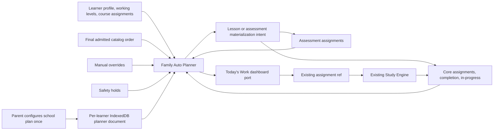

# Family Auto Planner R1

Status: production architecture, ready for Dashboard convergence after this branch is admitted.

## Scope and ownership

R1 lives entirely under `src/study/family-pilot/auto-planner/**`. It does not modify `App.tsx`, Student Dashboard, the final Family Pilot UI/controller, Study Engine, assessment scoring, working-level authority, or Tutor.

The planner is one grade/subject-neutral algorithm. It reads catalog course/unit/lesson order and works for every admitted combination: Grades 5, 7, and 8 across mathematics, English language arts, science, social studies, health, physical education, ready for life, technology, arts and music, and financial literacy. Grade 6 is deliberately absent from the admitted catalog. A Grade 6 learner must have an existing explicit supported working level per enabled subject; otherwise the result is `NEEDS_PLAN_SETUP` rather than an invented course or silent skip.

## Existing architecture reused

| Existing authority | R1 use |
| --- | --- |
| `Profile` and `FamilySetupStudent` | Read-only learner identity, nominal grade, enabled subjects, and working levels through adapters. |
| `Profile.academy.courseIds` | Preferred existing course assignments through `learnerFromProfile`. |
| Final curriculum runtime | Browser-safe admitted courses, units, assessment refs, and course-day lesson order. |
| Family Pilot Core assignments | Planned/active/paused/completed/abandoned lifecycle, completion, in-progress session ref, and manual assignments. |
| Family Pilot assessment assignments | Assessment materialization and `PLANNED`/`ACTIVE`/review/pending/certified authority. |
| Family Pilot safety holds | Exact learner/session blocking; only literal `cleared` permits work. |
| Existing daily schedule contract | `toExistingDailyScheduleInput` projects lesson items into `BuildDailyScheduleInput`. |
| Existing Study assignment contract | `nextFamilyAutoPlannerStudyTarget` returns the existing learner/assignment/lesson refs; Study owns every session transition. |
| Existing durable IndexedDB record layer | Planner documents use the accepted Family Pilot IndexedDB database/object store and atomic revision preconditions. |

The planner never stores content, answers, response drafts, transcripts, scoring material, or protected assessment interpretation.

## Flow

## School plan

`FamilyAutoPlannerSchoolPlanV1` is per learner and durable. It contains:

- an explicit IANA household time zone;
- school-year start/end dates;
- ISO weekdays plus explicit non-school and added-school dates;
- one entry per enabled subject, with order, pause state, local start time, daily lesson cap, and optional parent-selected course ref.

The plan does not copy or change nominal grade, working levels, enabled-subject authority, or course progress. If enabled subjects later diverge from the configured subject list, the planner returns `NEEDS_PLAN_SETUP`.

## Today plan states

| State | Meaning |
| --- | --- |
| `READY` | At least one existing or newly materialized item can be opened. Other subjects may still report explicit blockers. |
| `NO_SCHOOL_TODAY` | The school-local date is outside the school year, not a configured weekday, or an explicit day off. |
| `COMPLETE_FOR_TODAY` | Every enabled, unpaused subject is complete or has met its configured daily cap. |
| `NEEDS_PLAN_SETUP` | Plan missing/invalid, subject missing, working grade unsupported, or course selection missing/ambiguous. |
| `BLOCKED` | No work can proceed because of hold, pause, offline catalog needed for new work, failed materialization/persistence, or unresolved abandoned automatic work. |
| `WAITING_FOR_ASSESSMENT` | The next unit is gated on trusted scoring, adult rubric review, or guardian certification. |

`FamilyAutoPlannerTodayPlan` is the Dashboard integration contract. It includes the school-local date/time zone, ordered items, blockers, carry-forward provenance, manual-override signal, and offline-materialized-work signal.

## Lesson selection and daily rollover

For each enabled subject in parent-configured order, R1:

1. projects all unfinished Core work first;
2. treats an unfinished assignment without Auto Planner provenance as a manual parent override and creates no same-subject automatic item;
3. blocks but preserves work for a paused subject or exact-session safety hold;
4. applies the school-local daily cap, counting required manual and automatic completions on the school-local date they were completed (including carried work);
5. resolves the existing explicit course, existing enrolled course, or the single admitted grade/subject course;
6. walks units and lessons in release order, past completed lessons and explicit parent skips only;
7. stops on an abandoned automatic assignment for parent resolution;
8. materializes the first eligible lesson or required unit assessment;
9. advances beyond an assessment only after `CERTIFIED`.

An unfinished automatic item retains its original assignment ref and materialized date on later days. `carriedForwardFromDate` makes the rollover explicit. A completed item is never reopened or repeated. The next eligible item appears on the next call when the daily cap permits it; a plan with `lessonsPerDay > 1` can advance again on the same school-local date.

## Determinism and idempotency

There is no planner clock, randomness, or network assumption hidden in the pure computation. The caller supplies the instant and all facts. Automatic provenance uses a stable semantic ref derived from local date, subject, and a deterministic hash of the lesson/assessment ref. The coordinator also relies on the existing deterministic assignment refs and duplicate-safe Core/assessment materializers.

Repeated same-day calls therefore reuse the same assignment and provenance. A stale browser tab is refused by an atomic IndexedDB revision precondition. The coordinator reloads and retries bounded conflicts; it never overwrites a newer planner document.

## Persistence and offline behavior

`openFamilyAutoPlannerIndexedDbStore` reuses `openIndexedDbRecordStore` and the existing `manuel-academy.study.family-pilot-durable` IndexedDB database/object store. Records are scoped by encoded household and learner refs, schema-versioned, bounded, strictly parsed, and independently revisioned. Future envelope/schema versions become read-only.

Catalog chunks are needed only to select new work. Existing Core/assessment facts and planner provenance are loaded first. If the catalog is unavailable, already-materialized unfinished work remains `READY`, keeps the same assignment ref, and sets `offlineMaterializedWorkAvailable`. A new selection that genuinely needs catalog order reports `CATALOG_UNAVAILABLE`; it is never guessed. Study's own already-materialized durable bytes remain owned by the existing IndexedDB Study ports.

## Manual override

Manual assignment remains an exception/override. Any open Core lesson or active assessment without Auto Planner provenance is projected as `MANUAL_OVERRIDE` and suppresses a same-subject automatic assignment. A required manual completion consumes the configured daily slot. An explicit manual skip may advance course order; an abandoned automatic assignment cannot.

## Assessment boundary

R1 reads unit assessment refs and existing assessment-assignment status. It can request materialization through `FamilyAutoPlannerAssessmentPort`, but it cannot launch, score, review, certify, or attest. `PENDING_ASSESSMENT`, `ADULT_REVIEW_REQUIRED`, and `PENDING_GUARDIAN_ATTESTATION` stop course advancement. Only the existing `CERTIFIED` authority unlocks the next unit.

## Working-level boundary

Nominal grade is reporting truth. Working level is existing parent authority. R1 resolves `workingGradeBySubject[subject] ?? nominalGrade`, reads only supported published grades, and writes neither value. This is why a nominal Grade 6 learner can receive Grade 5 mathematics while remaining officially Grade 6.

## Multi-student isolation

Every read, write, assignment fact, assessment fact, hold, result, and IndexedDB record carries the exact household/learner scope. Each learner has a separate document and revision. Existing architecture adapters filter before projection. No API accepts an unscoped family-wide mutation.

## Dashboard and Study ports

Dashboard convergence should depend on `FamilyAutoPlannerDashboardPort.getTodayWork`. It may pass the returned plan through `toExistingDailyScheduleInput` for the existing daily schedule renderer. No Dashboard needs access to planner storage or selection internals.

Study convergence should call `nextFamilyAutoPlannerStudyTarget` and hand the returned existing assignment ref to the final Family Pilot controller/runtime. The planner does not implement start, pause, resume, checkpoint, segment completion, completion authority, safety, or recovery.

## Tutor boundary

R1 contains no Tutor V2, Tutor selection, prompt construction, AI adaptation, mastery decision, or generative behavior. Tutor availability and accepted Tutor/Core behavior remain inside the existing Study/final-composition boundary.

## Verification

The focused suite covers:

- repeated-call idempotency and deterministic assignment reuse;
- school-local rollover, daily cap, and immediate next work when the configured cap allows;
- unfinished/carry-forward work and manual overrides;
- weekdays, explicit days off/added days, and UTC/time-zone midnight boundaries;
- exact-session safety holds and paused subjects;
- assessment materialization, review wait, certification, and next-unit advancement;
- completed-lesson no-repeat and abandoned-auto no-skip behavior;
- all 30 admitted grade/subject combinations;
- explicit Grade 6 absence and supported working-level routing;
- multiple learner isolation;
- offline use of already-materialized work;
- IndexedDB reopen durability, record isolation, stale-tab conflict refusal, and future-version read-only behavior;
- Dashboard schedule projection and Study target projection.

## Convergence blockers

There is no planner-internal blocker. This wave intentionally does not wire the Dashboard or `App.tsx`. A later convergence wave must provide the narrow ports from the final Family Pilot controller/state and mount the Dashboard read port. That wiring must preserve the Core, assessment, safety, working-level, and Study authorities documented above.
