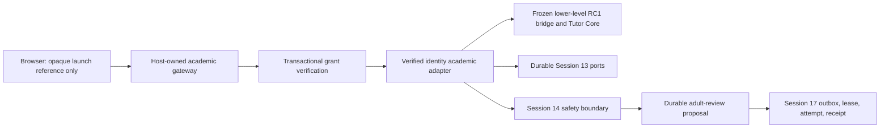

# Final production composition

The sentinel-bound RC1 convenience composition is not a production dependency. The host adapter uses only lower-level immutable interfaces with server-derived identity. Every durable operation must revalidate the opaque grant in the same database transaction; browser branding or lifecycle state is never authorization.
