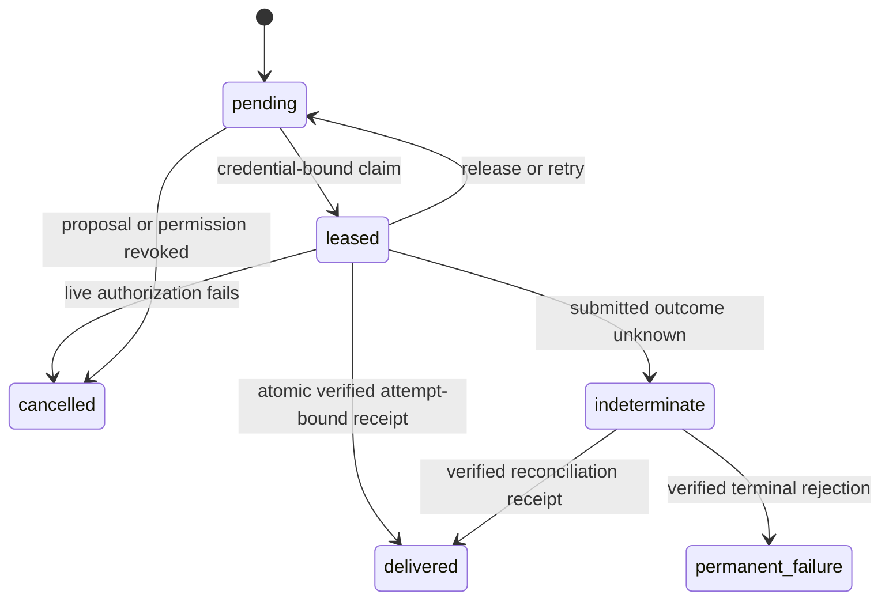

# Outbox, lease, attempt, and receipt state machine

Delivered requires a receipt bound to receipt ID, provider, route, job, attempt, proposal, household, student, recipient reference, idempotency key, provider configuration version, accepted/delivered timestamp, verification evidence, and receipt schema version. Receipt/event replay uses a unique event-idempotency key. Cancellation is revision-aware, idempotent, and audited.
