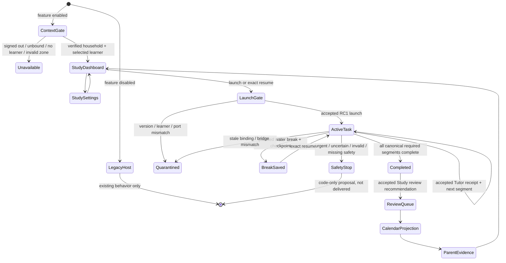

# Host Authority Matrix and Integration State

## Authority matrix

| Concern | Authority | Host integration rule |
|---|---|---|
| Assessment, mastery, misconceptions, prerequisites, guided practice, reteaching, remediation, Tutor directives, instructional safety evidence | Frozen Tutor Core 0.2.0 | Host displays accepted directives and minimized evidence only; it never derives mastery from QuizSession or completion. |
| Pacing, work-block/break recommendation, review scheduling, session evidence, focus adjustment | Study Engine RC1 | Host projects accepted plans/calendar/reviews and does not invent review or duration decisions. |
| Navigation, authenticated context, selected learner, page composition, curriculum references, Parent Hub, theme | Manuel Academy host | Existing screen-state navigation remains; host owns adapters and UI composition. |
| Safety gateway, Tutor-to-Study projection, permits, ledger ordering, PII minimization, unknown-event quarantine | Session 6-R2 bridge | All transient learner text enters the accepted bridge through the injected safety boundary; host persists only allowlisted minimized records. |
| Durable persistence, transactional outbox, canonical calendar/parent records | Session 13 | Session 12 supplies in-memory ports only and makes no durability claim. |
| Production classifier, secured voice/media, adult delivery | Session 14 | Session 12 supplies no production classifier/provider key/delivery implementation. |

## State diagram

## Privacy flow

Transient learner response exists only in React component memory and the accepted classifier/Tutor call. The response is cleared before the awaited result is processed. Ports accept only exact safe records with `rawAnswerIncluded: false` and `transcriptIncluded: false`. Jarvis transcript content is a transient list of approved presentation messages, not learner text, and clears on unmount.

Adult-private note bodies bypass parent public settings and commit directly through `StudyAdultPrivatePort`. Public test inspection intentionally excludes the private map.
