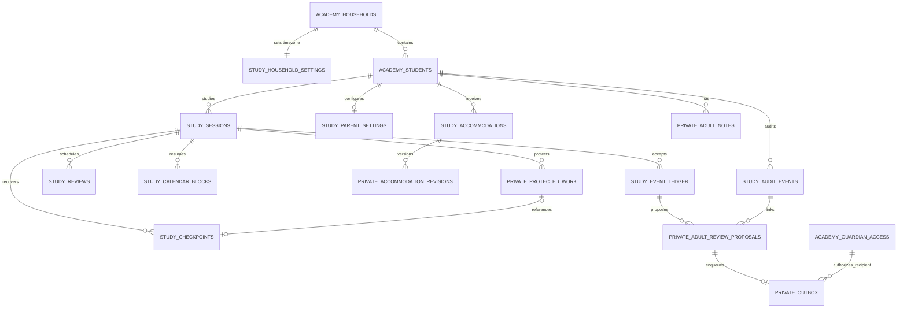

# Study Engine tables and relationships

The storage migration creates nine public and seven private tables. All Study
IDs are opaque bounded text unless they identify existing Academy UUID rows.
Composite foreign keys carry household and learner scope so a valid identifier
from another household cannot be substituted.

## Public tables

- `academy_study_household_settings`: canonical IANA household timezone.
- `academy_study_sessions`: versioned lesson/session lifecycle and local-date
  snapshot.
- `academy_study_event_ledger`: minimized append-only accepted events, unique by
  `(session_id, event_id)` with server collision detection.
- `academy_study_checkpoints`: exact recovery contract, CAS revision,
  server-computed integrity digest, and optional encrypted-work reference.
- `academy_study_reviews`: review scheduling state and retry-safe idempotency.
- `academy_study_calendar_blocks`: UTC instant, intended local date, canonical
  timezone, and explicit offset.
- `academy_study_parent_settings`: adult-managed Study controls.
- `academy_study_accommodations`: non-diagnostic, sourced, effective-dated
  accommodations.
- `academy_study_audit_events`: immutable minimized security/operation audit.

## Private tables

- `study_protected_learner_work`: revisioned AES-256-GCM envelope metadata and
  ciphertext, never included in ordinary settings or evidence projections.
- `study_adult_notes`: revisioned encrypted body and retention boundary.
- `study_accommodation_revisions`: immutable accommodation history.
- `study_adult_review_proposals`: structured, minimized, not-delivered proposal.
- `study_outbox`: authorized-recipient delivery state without disclosure text.
- `study_mutation_receipts`: request digest/result for retry-safe mutations.
- `study_persistence_metadata`: migration and security manifest.

The only modification to a pre-existing table is the additive unique index
`academy_student_session_grants_study_scope_idx` on
`academy_private.student_session_grants(id, household_id, student_id)`, used by
scoped audit foreign keys. No historical migration file is changed.
