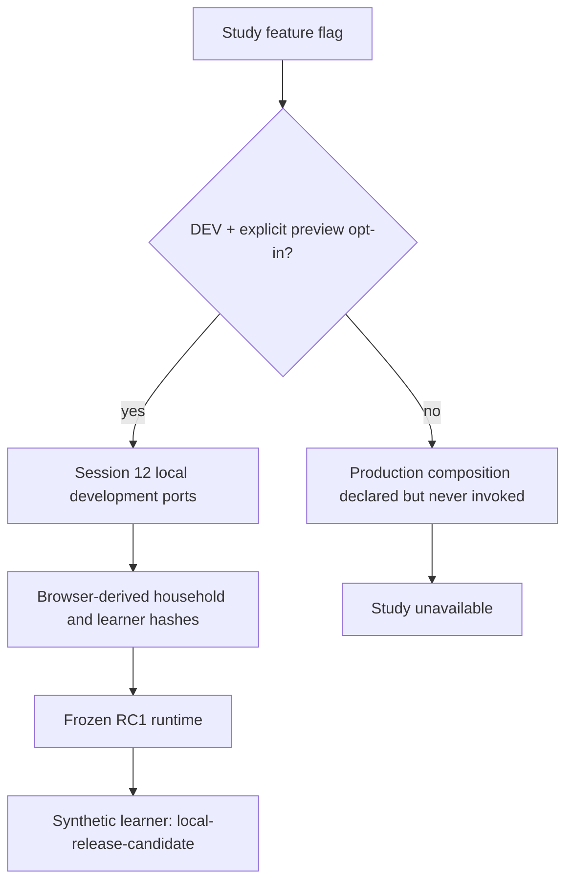
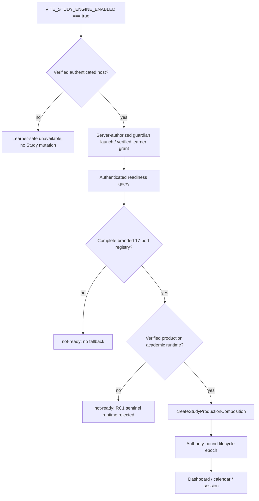

# Composition and host invocation

## Before state

The host mounted Study screens only through the explicit Session 12 preview. The preview path created local ports and preview parent authorization in the browser. The frozen RC1 runtime introduced `learner:local-release-candidate`; it was preview-reachable, not a verified production learner. The Session 15 production root existed as a declarative boundary but `src/App.tsx` did not call it.

## After state

## Host invocation map

`src/App.tsx` owns one `StudyLifecycleBoundary` and one readiness client for the mounted host. It calls `createStudyProductionComposition(...)` directly. It does not construct partial production services in child components.

| Host state | Behavior |
|---|---|
| Feature disabled | No Study navigation, readiness request, production registry, safety request, persistence request, or preview seed. |
| Enabled, unauthenticated/unverified binding | Safe unavailable state; no registry or server mutation. |
| Authenticated, dependency not-ready | Minimized readiness query only; no Tutor processing or durable write. |
| Fully authorized and ready | Composition contract supports verified authority, complete registry, verified academic runtime, and lifecycle epoch. This state is deliberately unreachable until Session 17 and runtime reconciliation finish. |

The host exposes a Study availability action in production-selected mode, then renders a safe unavailable screen. It never substitutes the preview composition. Sign-out cancels the current lifecycle and invalidates readiness.
