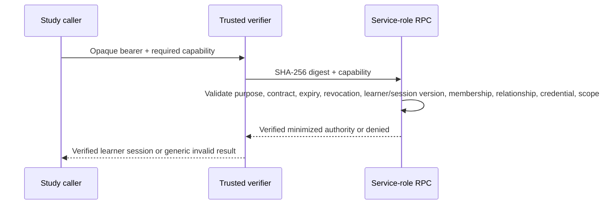

# Verified identity, learner sessions, and staff result

## Guardian launch

```mermaid
sequenceDiagram
  participant B as Browser
  participant N as Netlify issuer
  participant S as Supabase RPC
  participant D as Academy identity tables
  B->>N: Bearer session + learner selector only
  N->>N: Verify Supabase bearer
  N->>S: Authenticated issue RPC
  S->>D: Derive auth.uid, household, guardian membership, relationship, permission, credential
  D-->>S: One exact active learner binding
  S->>D: Revoke prior current Study grant; store SHA-256 digest of new opaque reference
  S-->>N: 15-minute grant metadata + one-time opaque reference
  N-->>B: Opaque reference and minimized binding
```

The browser can supply only `{kind, value}` for `academy-student-id` or `legacy-profile-id`. Household, membership, relationship, role, and permission are derived server-side. Ambiguous legacy selectors and cross-household selections are denied. Guardian authority requires an active household, active guardian membership, active relationship, `identity_manager`, an active learner credential, and an active learner record.

## Issuance

The additive migration extends the existing private grant table with Study purpose, contract version, random session epoch, and authorization revision. A guardian reissue revokes the previous current Study grant for the same guardian and learner before creating the replacement. The opaque reference has cryptographic entropy; only its SHA-256 digest is stored. The client retains the raw reference only in a closure, never in URL, localStorage, sessionStorage, AppState, events, or evidence.

The grant is bound to one household, learner, guardian, membership, relationship, credential version, learner session version, purpose, exact capability scope, issue time, expiry, and epoch. Audit columns record issuance/revocation evidence without a PIN or raw reference.

## Verification and revocation



Verification and revocation are service-role-only and additionally require the trusted-server claim. Revocation is idempotent and non-enumerating. Issue/verify/revoke functions pin `search_path=pg_catalog`, revoke public/anonymous access, and grant only the required role. Replay of an old reference after reissue, expiration, revocation, membership/relationship loss, credential rotation, or learner session-version change is denied.

The client uses a monotonically increasing generation so a late issue/verify result cannot overwrite or clear a newer learner session.

## Migration note

Created: `supabase/migrations/20260801160000_academy_study_verified_identity.sql`.

It is additive and guarded by the exact Session 13 metadata marker. It refuses unmarked object collisions. It adds only identity fields, indexes/constraint trigger, issue/verify/revoke/readiness RPCs, grants, and metadata evidence. It was exercised locally with PGlite and was not applied to hosted Supabase.

## Staff authorization

No approved staff role/permission governance model exists in the repository. Staff Study and staff adult-private access remain disabled. The production authority layer returns structured `staff-authorization-unavailable`. It does not infer staff from service role, email domain, parent PIN, UI route, browser claim, or local admin state.

Missing governance decision: approved staff principal source, roles, learner/household scope, adult-private permissions, audit policy, authorization revision/revocation semantics, and operational owner.
