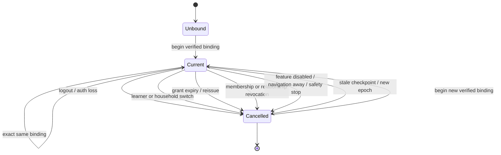

# Lifecycle and readiness

## Canonical lifecycle binding

One `StudyLifecycleBoundary` is shared by the host. Its epoch fingerprint includes authenticated session, household, learner, launch grant/evidence, feature state, authorization revision, expiration, and identity epochs.

Operations receive an `AbortSignal` and immutable operation context. The guarded runner verifies currency before and after every await, composes caller signals, and quarantines late results from non-cooperative dependencies. Stable operation references are single-use per epoch, preventing duplicate responses.

Race coverage includes learner A resolving after learner B, logout during safety/Tutor work, revocation during checkpoint save, feature disable during calendar work, old checkpoint after reauthentication, old grant after reissue, duplicate completion, and stale safety result.

The context is available to safety, Tutor, session, checkpoint, review, calendar, parent, adult-private, event-ledger, proposal, and outbox owned paths. Session 17 must propagate it through delivery/receipt workers.

## Readiness matrix

| Dependency group | Live evidence | Effect |
|---|---|---|
| Verified identity/resolution | verifier readiness RPC | non-ready/degraded blocks |
| Session 13 academic adapters | separately injected live academic RPC probe | non-ready/degraded blocks |
| Safety proposal/outbox/rate/recipient/monitoring | durable Supabase reconciliation probe | non-ready/degraded blocks |
| Production classifier | configured plus circuit state | open/degraded blocks |
| Delivery provider | Session 17 live probe | currently `not-ready` |
| Receipt validator | Session 17 live probe | currently `not-ready` |
| Verified academic runtime | module-private runtime brand, production identity acceptance, no sentinel | currently absent |

Only `ready` permits academic processing. `not-ready` and `degraded` both block. Server snapshots cache for a bounded 1–60 seconds and deduplicate in-flight refresh. Browser snapshots require authenticated bearer, accept only exact `{schemaVersion,status,expiresAt}`, cap server TTL to 60 seconds, support forced revalidation/cancellation, and fail closed for malformed, expired, unauthorized, or unavailable responses.

The host queries readiness only after the feature is selected and the Supabase binding is verified. It invalidates on auth/feature loss and cancels the lifecycle when readiness ceases to be ready. Dependency names and reasons remain server-internal.
