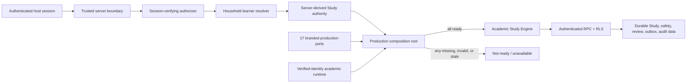

# Production composition diagram

The feature flag controls visibility only. It cannot manufacture authority, satisfy readiness, select a local adapter, or turn a synthetic runtime into a production runtime.
