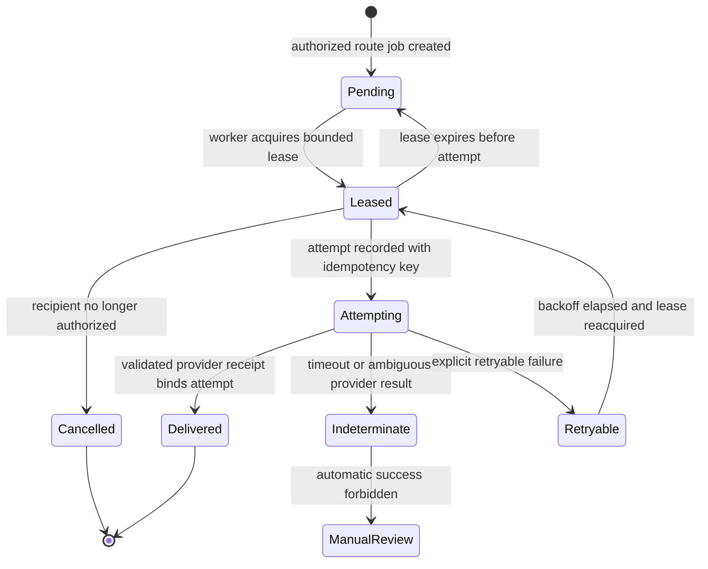

# Outbox state machine

```mermaid
stateDiagram-v2
  [*] --> Pending: authorized route job created
  Pending --> Leased: worker acquires bounded lease
  Leased --> Pending: lease expires before attempt
  Leased --> Cancelled: recipient no longer authorized
  Leased --> Attempting: attempt recorded with idempotency key
  Attempting --> Delivered: validated provider receipt binds attempt
  Attempting --> Indeterminate: timeout or ambiguous provider result
  Attempting --> Retryable: explicit retryable failure
  Retryable --> Leased: backoff elapsed and lease reacquired
  Indeterminate --> ManualReview: automatic success forbidden
  Delivered --> [*]
  Cancelled --> [*]
```

Workers must prove lease ownership and current authorization at effect time. A receipt for a different route, proposal, recipient, provider, or attempt cannot close a job.
